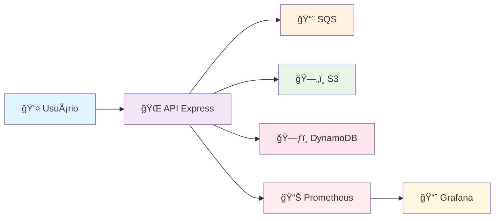

# 🚀 Simulador Local de Serviços AWS

<div align="center">


**Ambiente completo para simular serviços AWS localmente com monitoramento e observabilidade**

[](https://github.com/seu-usuario/projeto-localstack)
[](https://github.com/seu-usuario/projeto-localstack)
[](https://github.com/seu-usuario/projeto-localstack/issues)
[](https://github.com/seu-usuario/projeto-localstack/blob/main/LICENSE)

</div>

---

## 📋 Índice

- [🎯 Sobre o Projeto](#-sobre-o-projeto)
- [🏗️ Arquitetura](#️-arquitetura)
- [📁 Estrutura do Projeto](#-estrutura-do-projeto)
- [🛠️ Tecnologias](#️-tecnologias)
- [⚡ Quick Start](#-quick-start)
- [🔧 Instalação Detalhada](#-instalação-detalhada)
- [📚 Como Usar](#-como-usar)
- [📊 Monitoramento](#-monitoramento)
- [🧪 Testes](#-testes)
- [🚨 Troubleshooting](#-troubleshooting)
- [🤝 Contribuição](#-contribuição)

---

## 🎯 Sobre o Projeto

### 💡 O que é?

Este projeto simula serviços AWS (S3, SQS, DynamoDB) localmente usando Node.js/Express, LocalStack, Docker, Prometheus, Grafana, JWT e Terraform. **Ideal para estudo, testes, DevOps e validação de integrações cloud sem custos.**

### 🎯 Problemas que Resolve

| Problema | Solução |
|----------|---------|
| 💰 **Custos altos** de desenvolvimento em nuvem | ✅ **Ambiente local gratuito** |
| 🔒 **Dificuldade** para testar integrações AWS | ✅ **Simulação completa** dos serviços |
| 📚 **Complexidade** para aprender AWS/DevOps | ✅ **Ambiente didático** e prático |
| 🔐 **Segurança** em testes de autenticação | ✅ **Ambiente isolado** e seguro |

### ☁️ Serviços AWS Simulados

| Serviço | Descrição | Status |
|---------|-----------|--------|
| 🗄️ **S3** | Armazenamento de objetos | ✅ Funcionando |
| 📨 **SQS** | Fila de mensagens | ✅ Funcionando |
| 🗃️ **DynamoDB** | Banco NoSQL | ✅ Funcionando |

---

## 🏗️ Arquitetura



### 🔄 Fluxo de Dados

1. **👤 Usuário** faz requisição para a API
2. **🌐 API Express** processa com autenticação JWT
3. **📨 SQS** recebe mensagens
4. **🗄️ S3** armazena arquivos
5. **🗃️ DynamoDB** persiste dados
6. **📊 Prometheus** coleta métricas
7. **📈 Grafana** visualiza dados

---

## 📁 Estrutura do Projeto

```
projeto-localstack/
├── 🐳 docker-compose.yml          # Orquestração dos containers
├── 🚀 localstack-api/             # API Node.js com Express
│   ├── 🐳 Dockerfile              # Container da API
│   ├── 📄 index.js                # Ponto de entrada da API
│   ├── 📂 api/                    # Estrutura modular da API
│   │   ├── ⚙️ app.js              # Configuração do Express
│   │   ├── 🛣️ routes/             # Rotas da API
│   │   ├── 🔒 middlewares/        # Middlewares (JWT, retry)
│   │   ├── 🔧 services/           # Serviços (AWS, Prometheus)
│   │   └── 🛠️ utils/              # Utilitários
│   ├── 📦 package.json            # Dependências da API
│   └── 🚀 start.sh                # Script de inicialização
├── 🏗️ terraform/                  # Infraestrutura como código
│   └── 📄 main.tf                 # Configuração Terraform
├── 📊 grafana/                    # Dashboards do Grafana
│   ├── 📈 grafana-dashboard.json  # Dashboard principal
│   └── 📖 README.md               # Instruções de importação
├── 🧪 scripts/                    # Scripts de teste e automação
│   ├── 🔄 generate-traffic.js     # Gerador de tráfego
│   ├── 📦 package.json            # Dependências dos scripts
│   └── 📖 README.md               # Instruções de uso
├── 📊 prometheus.yml              # Configuração do Prometheus
├── 🛠️ setup_infra.sh              # Script de setup da infraestrutura
└── 📖 README.md                   # Este arquivo
```

---

## 🛠️ Tecnologias

<div align="center">

| Categoria | Tecnologia | Versão | Descrição |
|-----------|------------|--------|-----------|
| **🌠Backend** |  | 18.x | Runtime JavaScript |
| **🌠Framework** |  | 4.x | Framework Web |
| **🳠Containerização** |  | Latest | Orquestração |
| **☁️ AWS Local** |  | Latest | Simulação AWS |
| **🏗️ IaC** |  | 1.x | Infraestrutura |
| **📊 Monitoramento** |  | Latest | Métricas |
| **📈 Visualização** |  | Latest | Dashboards |
| **🔠Autenticação** |  | - | Autenticação |

</div>

---

## ⚡ Quick Start

### 🚀 Início Rápido (3 minutos)

```bash
# 1️⃣ Clone o repositório
git clone https://github.com/seu-usuario/projeto-localstack.git
cd projeto-localstack

# 2️⃣ Suba o ambiente
docker-compose up -d

# 3️⃣ Acesse os serviços
# 🌐 API: http://localhost:3000
# 📊 Grafana: http://localhost:3001 (admin/admin)
# 📈 Prometheus: http://localhost:9090
# ☁️ LocalStack: http://localhost:4566
```

### 🎯 Teste Rápido

```bash
# 🔐 Login para obter token JWT
curl -X POST http://localhost:3000/auth/login \
  -H "Content-Type: application/json" \
  -d '{"user":"admin","password":"123"}'

# 📨 Enviar mensagem para SQS (use o token obtido)
curl -X POST http://localhost:3000/sqs/send \
  -H "Authorization: Bearer SEU_TOKEN_AQUI" \
  -H "Content-Type: application/json" \
  -d '{"message": "Olá, LocalStack!"}'
```

---

## 🔧 Instalação Detalhada

### 📋 Pré-requisitos

| Software | Versão | Como Instalar |
|----------|--------|---------------|
|  | 20.x+ | [Docker Desktop](https://www.docker.com/products/docker-desktop) |
|  | 2.x+ | Incluído no Docker Desktop |
|  | 18.x+ | [Node.js](https://nodejs.org/) |
|  | 1.x+ | [Terraform](https://www.terraform.io/downloads) |
|  | 2.x+ | [AWS CLI](https://aws.amazon.com/cli/) |

### 🚀 Passo a Passo Completo

#### 1️⃣ **Clone e Prepare**

```bash
# Clone o repositório
git clone https://github.com/seu-usuario/projeto-localstack.git
cd projeto-localstack

# Verifique se o Docker está rodando
docker --version
docker-compose --version
```

#### 2️⃣ **Suba o Ambiente**

```bash
# Construa e suba todos os containers
docker-compose up --build -d

# Verifique se todos estão rodando
docker-compose ps
```

#### 3️⃣ **Configure a Infraestrutura (Opcional)**

```bash
# Entre na pasta do Terraform
cd terraform

# Inicialize o Terraform
terraform init

# Aplique a configuração
terraform apply -auto-approve

# Volte para a pasta raiz
cd ..
```

#### 3️⃣.1 **Atenção: Atualize o Terraform e Provider AWS para LocalStack**

> **Importante!**
>
> Para evitar erros de timeout ou problemas ao criar recursos SQS/DynamoDB/S3 no LocalStack, garanta que o bloco `provider` do seu `main.tf` está assim:
>
> ```hcl
> provider "aws" {
>   region                      = "us-east-1"
>   access_key                  = "test"
>   secret_key                  = "test"
>   skip_credentials_validation = true
>   skip_metadata_api_check     = true
>   skip_requesting_account_id  = true
>   skip_region_validation      = true
>   s3_use_path_style           = true
>   endpoints {
>     sqs      = "http://localhost:4566"
>     s3       = "http://localhost:4566"
>     dynamodb = "http://localhost:4566"
>   }
> }
> ```
>
> Se ocorrer erro de timeout ao aplicar o Terraform:
> 1. Limpe o state da fila SQS:
>    ```sh
>    terraform state rm aws_sqs_queue.minha_fila
>    ```
> 2. Delete a fila manualmente se necessário:
>    ```sh
>    aws --endpoint-url=http://localhost:4566 sqs delete-queue --queue-url http://localhost:4566/000000000000/minha-fila
>    ```
> 3. Rode novamente o `terraform apply`.
>
> **Garanta também que está usando uma versão recente do provider AWS:**
> ```hcl
> terraform {
>   required_providers {
>     aws = {
>       source  = "hashicorp/aws"
>       version = ">= 4.0"
>     }
>   }
> }
> ```

#### 3️⃣.2 **Execute os testes automatizados**

Após a infraestrutura estar criada, execute os testes automatizados para validar o ambiente:

```bash
cd scripts
npm install
npm run test:all
cd ..
```

#### 4️⃣ **Valide os Recursos**

```bash
# Verifique se os recursos foram criados
aws --endpoint-url=http://localhost:4566 s3 ls --output json
aws --endpoint-url=http://localhost:4566 sqs list-queues --output json
aws --endpoint-url=http://localhost:4566 dynamodb list-tables --output json
```

#### 5️⃣ **Acesse os Serviços**

| Serviço | URL | Credenciais | Descrição |
|---------|-----|-------------|-----------|
| 🌐 **API** | http://localhost:3000 | - | API principal |
| 🎯 **Dashboard de Testes** | http://localhost:3001 | - | Interface visual para testes |
| 📊 **Grafana** | http://localhost:3002 | admin/admin | Dashboards |
| 📈 **Prometheus** | http://localhost:9090 | - | Métricas |
| ☁️ **LocalStack** | http://localhost:4566 | - | Simulação AWS |

---

## 📚 Como Usar

### 🔐 Autenticação JWT

A API usa autenticação JWT. Primeiro, faça login para obter um token:

```bash
# 🔑 Login
curl -X POST http://localhost:3000/auth/login \
  -H "Content-Type: application/json" \
  -d '{
    "user": "admin",
    "password": "123"
  }'

# 📤 Resposta esperada:
# {
#   "token": "eyJhbGciOiJIUzI1NiIsInR5cCI6IkpXVCJ9..."
# }
```

### 📨 **SQS - Enviar Mensagem**

```bash
# 📤 Enviar mensagem para fila SQS
curl -X POST http://localhost:3000/sqs/send \
  -H "Authorization: Bearer SEU_TOKEN_JWT" \
  -H "Content-Type: application/json" \
  -d '{
    "message": "Mensagem de teste para SQS"
  }'

# ✅ Resposta esperada:
# {
#   "message": "Mensagem enviada com sucesso para SQS!",
#   "messageId": "12345678-1234-1234-1234-123456789012"
# }
```

### 🗄️ **S3 - Upload de Arquivo**

```bash
# 📁 Upload de arquivo para S3
curl -X POST http://localhost:3000/s3/upload \
  -H "Authorization: Bearer SEU_TOKEN_JWT" \
  -H "Content-Type: application/json" \
  -d '{
    "key": "meu-arquivo.txt",
    "content": "Conteúdo do arquivo"
  }'

# ✅ Resposta esperada:
# {
#   "message": "Arquivo enviado com sucesso para o S3!",
#   "key": "meu-arquivo.txt"
# }
```

### 🗃️ **DynamoDB - Operações**

```bash
# ➕ Inserir item no DynamoDB
curl -X POST http://localhost:3000/dynamodb/item \
  -H "Authorization: Bearer SEU_TOKEN_JWT" \
  -H "Content-Type: application/json" \
  -d '{
    "id": "123",
    "nome": "João Silva",
    "idade": 30,
    "email": "joao@email.com"
  }'

# ✅ Resposta esperada:
# {
#   "message": "Item inserido com sucesso no DynamoDB!",
#   "item": { "id": "123", "nome": "João Silva", ... }
# }

# 🔍 Buscar item no DynamoDB
curl -X GET http://localhost:3000/dynamodb/item/123 \
  -H "Authorization: Bearer SEU_TOKEN_JWT"

# ✅ Resposta esperada:
# {
#   "message": "Item encontrado no DynamoDB!",
#   "item": { "id": "123", "nome": "João Silva", ... }
# }
```

### 🏥 **Health Check**

```bash
# 🏥 Verificar status dos serviços
curl -X GET http://localhost:3000/health

# ✅ Resposta esperada:
# {
#   "timestamp": "2025-07-19T23:48:08.961Z",
#   "status": "healthy",
#   "services": {
#     "localstack": { "status": "healthy" },
#     "s3": { "status": "healthy" },
#     "sqs": { "status": "healthy" },
#     "dynamodb": { "status": "healthy" }
#   }
# }
```

### 📊 **Métricas Prometheus**

```bash
# 📈 Ver métricas da API
curl -X GET http://localhost:3000/metrics
```

---

## 📊 Monitoramento

### 📈 **Grafana Dashboards**

#### 🚀 **Importar Dashboard**

1. **Acesse o Grafana:** http://localhost:3002
2. **Login:** admin / admin
3. **Importe o dashboard:**
   - Clique em **"+"** → **"Import"**
   - Selecione o arquivo: `grafana/grafana-dashboard.json`
   - Configure **"Prometheus"** como fonte de dados
   - Clique em **"Import"**

#### 📊 **Painéis Disponíveis**

| Painel | Descrição | Métrica |
|--------|-----------|---------|
| 🔴 **LocalStack Health** | Status geral do LocalStack | `localstack_health_status` |
| 🗄️ **S3 Health** | Status do serviço S3 | `aws_service_health_status{service="s3"}` |
| 📨 **SQS Health** | Status do serviço SQS | `aws_service_health_status{service="sqs"}` |
| 🗃️ **DynamoDB Health** | Status do serviço DynamoDB | `aws_service_health_status{service="dynamodb"}` |
| 💻 **CPU Usage** | Uso de CPU da aplicação | `process_cpu_user_seconds_total` |
| 💾 **Memory Usage** | Uso de memória da aplicação | `process_resident_memory_bytes` |

### 📈 **Prometheus**

- **URL:** http://localhost:9090
- **Métricas:** http://localhost:3000/metrics
- **Configuração:** `prometheus.yml`

---

## 🧪 Testes

### 🎯 Dashboard Visual (Recomendado)

Para uma experiência visual completa e interativa, use o dashboard web:

```bash
# Navegar para a pasta do dashboard
cd test-dashboard

# Instalar dependências
npm install

# Iniciar o dashboard
npm start
```

**Acesse:** http://localhost:3001

#### ✨ Funcionalidades do Dashboard
- **Interface Moderna** - Design responsivo e intuitivo
- **Testes Visuais** - Cards individuais para cada teste
- **Status em Tempo Real** - Acompanhamento visual do progresso
- **Logs Interativos** - Visualização detalhada da execução
- **Métricas Visuais** - Gráficos e indicadores de performance
- **Execução Individual** - Execute testes específicos
- **Execução em Lote** - Execute todos os testes de uma vez

### 🚀 Testes Automatizados

O projeto inclui uma suíte completa de testes automatizados localizada na pasta `scripts/`.

#### 📋 Tipos de Testes Disponíveis

| Tipo | Script | Descrição |
|------|--------|-----------|
| 🧪 **Integração** | `test-integration.js` | Valida todos os endpoints e funcionalidades |
| 📈 **Carga** | `test-load.js` | Testa performance sob diferentes cargas |
| 🔄 **Tráfego** | `generate-traffic.js` | Gera tráfego contínuo para métricas |

#### 🎯 Executar Todos os Testes

```bash
# Navegar para a pasta de scripts
cd scripts

# Instalar dependências
npm install

# Executar todos os testes
npm run test:all
```

#### 📊 Testes Individuais

```bash
# Testes de integração
npm run integration

# Testes de carga
npm run load

# Geração de tráfego
npm run generate-traffic
```

#### 📈 Resultados dos Testes

Os testes geram relatórios detalhados:

- **`test-results.json`** - Resultados dos testes de integração
- **`load-test-results.json`** - Resultados dos testes de carga

**Exemplo de saída:**
```
🚀 Iniciando Testes de Integração...
==================================================
✅ Health Check
✅ Authentication
✅ SQS Send Message
✅ S3 Upload
✅ DynamoDB Insert
✅ DynamoDB Get
✅ Prometheus Metrics

📊 RESUMO DOS TESTES
==================================================
Total de Testes: 7
✅ Passaram: 7
❌ Falharam: 0
📈 Taxa de Sucesso: 100.0%

🎯 Status Final:
✅ TODOS OS TESTES PASSARAM!
```

### 🔧 Testes Manuais

#### Teste de Conectividade
```bash
# Health Check
curl http://localhost:3000/health

# Resposta esperada:
# {"status":"OK","timestamp":"2024-01-01T12:00:00.000Z"}
```

#### Teste de Autenticação
```bash
# Login
curl -X POST http://localhost:3000/auth/login \
  -H "Content-Type: application/json" \
  -d '{"user":"admin","password":"123"}'

# Resposta esperada:
# {"token":"eyJhbGciOiJIUzI1NiIsInR5cCI6IkpXVCJ9..."}
```

#### Teste de Endpoints Protegidos
```bash
# Usar o token obtido no login
TOKEN="seu_token_aqui"

# SQS - Enviar mensagem
curl -X POST http://localhost:3000/sqs/send \
  -H "Authorization: Bearer $TOKEN" \
  -H "Content-Type: application/json" \
  -d '{"message": "Teste de mensagem"}'

# S3 - Upload de arquivo
curl -X POST http://localhost:3000/s3/upload \
  -H "Authorization: Bearer $TOKEN" \
  -H "Content-Type: application/json" \
  -d '{"filename": "teste.json", "content": "{\"teste\": true}"}'

# DynamoDB - Inserir item
curl -X POST http://localhost:3000/dynamodb/item \
  -H "Authorization: Bearer $TOKEN" \
  -H "Content-Type: application/json" \
  -d '{"id": "teste-1", "name": "Item Teste", "description": "Descrição do item"}'
```

### 📊 Interpretação dos Resultados

#### ✅ Testes de Integração
- **Taxa de Sucesso ≥ 90%**: Sistema funcionando bem
- **Taxa de Sucesso < 90%**: Verificar configurações e conectividade

#### 📈 Testes de Carga
- **Tempo Médio < 500ms**: Excelente performance
- **Tempo Médio 500-1000ms**: Performance aceitável
- **Tempo Médio > 1000ms**: Necessita otimização
- **Taxa de Sucesso ≥ 95%**: Sistema estável
- **Taxa de Sucesso < 95%**: Possíveis gargalos

### 🎯 Cenários de Teste de Carga

1. **Carga Baixa** (10 requests simultâneos)
2. **Carga Média** (50 requests simultâneos)
3. **Carga Alta** (100 requests simultâneos)
4. **Teste de Stress** (50 requests protegidos)
5. **Teste de Resistência** (30 segundos contínuos)

### 🚨 Troubleshooting dos Testes

#### Problemas Comuns:
1. **API não responde**: Verificar se o Docker Compose está rodando
2. **Erro de autenticação**: Verificar credenciais admin/123
3. **Timeout nos testes**: Aumentar intervalos entre requests
4. **Falhas em S3/SQS**: Verificar conectividade com LocalStack

#### Logs Úteis:
```bash
# Ver logs do container da API
docker-compose logs localstack-api

# Ver logs do LocalStack
docker-compose logs localstack

# Verificar status dos containers
docker-compose ps
```

---

## 🚨 Troubleshooting

### ❌ **Problemas Comuns**

| Problema | Sintoma | Solução |
|----------|---------|---------|
| 🔴 **API não sobe** | Container em loop infinito | Verificar logs: `docker-compose logs api` |
| 🔴 **LocalStack unhealthy** | Status "unhealthy" | Ignorar se responde em `/_localstack/health` |
| 🔴 **DynamoDB não existe** | Erro "table does not exist" | Executar `terraform apply` |
| 🔴 **S3 não funciona** | Erro de endpoint | Verificar configuração `s3ForcePathStyle` |
| 🔴 **Grafana sem dados** | Painéis vazios | Verificar fonte de dados Prometheus |

### 🔧 **Comandos de Diagnóstico**

```bash
# 📊 Verificar status dos containers
docker-compose ps

# 📋 Ver logs da API
docker-compose logs api

# 📋 Ver logs do LocalStack
docker-compose logs localstack

# 🔍 Verificar se LocalStack responde
curl http://localhost:4566/_localstack/health

# 🔍 Verificar se API responde
curl http://localhost:3000/health

# 🔍 Verificar métricas
curl http://localhost:3000/metrics
```

### 🔄 **Reinicialização Completa**

```bash
# 🛑 Parar tudo
docker-compose down

# 🧹 Limpar volumes (opcional)
docker-compose down -v

# 🚀 Subir novamente
docker-compose up --build -d

# 🏗️ Recriar infraestrutura
cd terraform
terraform apply -auto-approve
cd ..
```

### 📋 **Checklist de Verificação**

- [ ] Docker está rodando
- [ ] Portas 3000, 3001, 9090, 4566 estão livres
- [ ] Containers estão rodando: `docker-compose ps`
- [ ] LocalStack responde: `curl http://localhost:4566/_localstack/health`
- [ ] API responde: `curl http://localhost:3000/health`
- [ ] Terraform foi aplicado: `terraform state list`

---

## 🤝 Contribuição

### 🎯 **Como Contribuir**

1. **🔀 Fork** o projeto
2. **🌿 Crie** uma branch: `git checkout -b feature/nova-funcionalidade`
3. **💾 Commit** suas mudanças: `git commit -m 'Adiciona nova funcionalidade'`
4. **📤 Push** para a branch: `git push origin feature/nova-funcionalidade`
5. **📝 Abra** um Pull Request

### 📋 **Diretrizes**

- ✅ Mantenha o código limpo e documentado
- ✅ Adicione testes para novas funcionalidades
- ✅ Atualize a documentação quando necessário
- ✅ Siga as convenções de commit do projeto

### 🐛 **Reportar Bugs**

Use o [GitHub Issues](https://github.com/seu-usuario/projeto-localstack/issues) para reportar bugs ou solicitar funcionalidades.

---

## 📄 **Licença**

Este projeto está licenciado sob a Licença MIT - veja o arquivo [LICENSE](LICENSE) para detalhes.

---

## 👨‍💻 **Autor**

<div align="center">

**Luan da Silva Ramalho**

[](https://github.com/seu-usuario)
[](https://linkedin.com/in/seu-usuario)
[](mailto:seu-email@exemplo.com)

**Desenvolvido com ❤️ em Julho/2025**

</div>

---

<div align="center">

⭐ **Se este projeto te ajudou, considere dar uma estrela!** ⭐

[](https://github.com/seu-usuario/projeto-localstack)

</div> 
